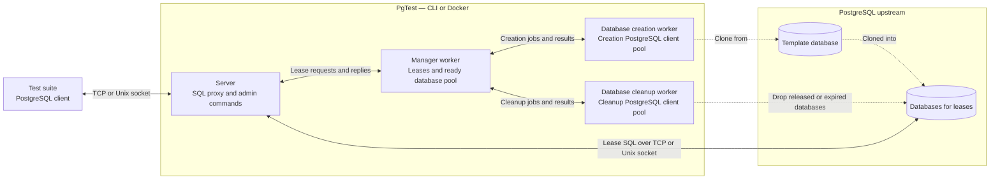

# PgTest

[](https://github.com/Afsoon/pgTest/actions/workflows/tests.yml)
[](https://github.com/Afsoon/pgTest/actions/workflows/release.yml)
[](#license)
[](rust-toolchain.toml)

PgTest is a PostgreSQL proxy that manages isolated databases for integration tests.
Connect using a lease ID to get a database cloned from your template. Connections
with the same lease ID share that database; different IDs get separate databases.
Your application uses its usual PostgreSQL client.

PgTest is still under active development. Version 1.0 will mark the point where
it has proven reliable and performant across test suites of all sizes, both on
local machines and in CI environments.
You can use the current version to see how it works with your test suite.

## Motivation

[IntegreSQL](https://github.com/allaboutapps/integresql) was an inspiration, but
it was unmaintained when I started this project. Managing test databases through
a separate API, along with its time-based recycling, required too much tuning
for my test suites.

I wanted to simplify that workflow, so I built PgTest as a PostgreSQL proxy.
Database assignment and explicit cleanup happen through PostgreSQL connections,
using the test suite's existing client instead of requiring a separate integration
for each language.

### Performance

These timings compare IntegreSQL with PgTest using the test suite in
[demo-post-node-integresql](https://github.com/Afsoon/demo-post-node-integresql).
The suite contains **226 tests across 15 files**.
This is the only repository used so far to measure performance improvements,
so the results are indicative rather than a comprehensive benchmark.

| Test environment | IntegreSQL (before) | PgTest (now) |
| --- | --- | --- |
| Local — M1 Pro, 32 GB RAM | ~7 s | ~5 s |
| CI — shard 1 | 25.04 s | 14.47 s |
| CI — shard 2 | 28.21 s | 13.37 s |
| CI — shard 3 | 28.32 s | 13.80 s |
| CI — without sharding | 41.99 s | 29.45 s |

Pipeline results:

- [IntegreSQL, sharded](https://github.com/Afsoon/demo-post-node-integresql/actions/runs/32628132498)
- [PgTest](https://github.com/Afsoon/demo-post-node-integresql/actions/runs/35735560262/job/106771774389?pr=1)
- [IntegreSQL, without sharding](https://github.com/Afsoon/demo-post-node-integresql/actions/runs/32278970555/job/96152946167)

## Goals

- Require minimal changes to application code and test setup. Keep using the
  existing PostgreSQL client, including for administrative operations exposed
  as SQL commands, following the approach of
  [PgBouncer's admin console](https://www.pgbouncer.org/usage.html#admin-console).
- Minimize proxy overhead so that creating databases from a template becomes
  the bottleneck, rather than the proxy itself.

## Non-goals

Managing multiple PostgreSQL upstream instances through one proxy is outside
the scope of PgTest and its planned development. Use one PgTest proxy per
PostgreSQL instance.

## Constraints

- **PostgreSQL 13 or later is required.** Some optional tuning settings shown
  below require newer versions.
- **Lease IDs must contain 1–256 UTF-8 bytes**, with no `/` or NUL characters.
  This allows up to 256 ASCII characters; multibyte characters use more of the
  limit.
- **The upstream `postgres` database must exist and be accessible to the
  configured user.** PgTest connects to it for database management. Use a
  separate database as the template, and keep all connections to that template
  closed while PgTest is cloning it: cloning requires zero active connections
  to the template.
- **The connection database name `pgtest` is reserved for administrative
  operations.** It selects the virtual control database. Test connections must
  use `<template>/<lease-id>`.

## Install

### Homebrew

Install the CLI on Apple Silicon macOS or Linux (ARM64/x86_64):

```sh
brew install Afsoon/tap/pgtest
pgtest version
```

### Docker image

The image is available at `ghcr.io/afsoon/pgtest` for Linux ARM64 and x86_64.
**Prefer the commit-hash tag over the version tag** to identify the exact source
commit used to build the image. Replace `<12-character-commit>` with the first
12 characters of the released server commit:

```sh
docker pull 'ghcr.io/afsoon/pgtest:sha-<12-character-commit>'
```

Version tags such as `ghcr.io/afsoon/pgtest:v0.1.0` are also available. Each release
publishes both tags for the same image.

### macOS releases

macOS CLI releases ship without Apple Developer ID signing or
notarization. Depending on how the binary is downloaded, macOS may warn or block
its first launch. If you trust the download, follow
[Apple's instructions](https://support.apple.com/en-us/102445) to approve it in
**System Settings → Privacy & Security → Open Anyway**, when available.

## Usage

Start with an existing PostgreSQL instance and a template database containing your
test schema and seed data. The examples use a template named `test_template`, an
upstream user named `postgres`, and PostgreSQL on port `5432`.

The upstream user must be able to clone the template and create and drop databases.
Finish migrations and close connections to the template before PgTest starts
cloning it. Leased application connections currently require upstream `trust`
authentication; password authentication and TLS are not supported on that path.
Database management currently uses the configured user with the fixed password
`postgres`. Use a PostgreSQL instance dedicated to tests.

Choose one launch method below. Both expose PgTest on `127.0.0.1:6432`.

### CLI

After installing with Homebrew, start the CLI:

```sh
pgtest serve \
  --pg-host 127.0.0.1 --pg-port 5432 \
  --pg-user postgres --pg-database test_template \
  --listen-addr 127.0.0.1 --listen-port 6432
```

### Docker

Run the published image using the commit-hash tag selected during installation:

```sh
docker run --rm --name pgtest \
  --add-host=host.docker.internal:host-gateway \
  -p 127.0.0.1:6432:6432 \
  -e PGTEST_PG_HOST=host.docker.internal \
  -e PGTEST_PG_PORT=5432 \
  -e PGTEST_PG_USER=postgres \
  -e PGTEST_PG_DATABASE=test_template \
  'ghcr.io/afsoon/pgtest:sha-<12-character-commit>'
```

This example connects to PostgreSQL on the Docker host. PostgreSQL must listen on
an address reachable from the container and permit its connections. If PostgreSQL
is another container, put both containers on the same Docker network and use its
container name as `PGTEST_PG_HOST` instead. `127.0.0.1` inside the PgTest container
refers to that container, not the host.

### Connect and release

In another terminal, connect through PgTest using `test_template/<lease-id>` as
the database name:

```sh
psql 'host=127.0.0.1 port=6432 user=postgres dbname=test_template/test-1 sslmode=disable' \
  -c 'SELECT current_database();'
```

PgTest assigns a cloned database on the first connection. Reconnect with `test-1`
to share it, or use a different ID for an isolated database. Disconnecting the last
client leaves the lease assigned. Use a fresh ID for each test invocation.

After the test, connect to the virtual `pgtest` control database and release the
lease:

```sh
psql 'host=127.0.0.1 port=6432 user=postgres dbname=pgtest sslmode=disable' \
  -c "SELECT pgtest_release('test-1');"
```

Release closes active connections for that lease and schedules its database for
cleanup. The ID cannot be reused during that PgTest process. Leases also expire
after **30 seconds** by default, measured from database assignment. For longer
tests, increase `--lease-claim-timeout-ms` or `PGTEST_LEASE_CLAIM_TIMEOUT_MS`; `0`
disables expiry. Run the connection and release examples within that interval.

See [control SQL commands](crates/pgtest-wire/README.md#accepted-sql-commands) for
the supported commands and parameterized release syntax.

## Integrate

See the [JavaScript / TypeScript example](example/example-js-containers/README.md)
for a Hono API tested with Vitest and Testcontainers. It demonstrates concurrent
test isolation, shared connections, and explicit lease cleanup through PgTest.

The [Rust example](example/example-rust-cli/README.md) uses Tokio and
`tokio-postgres`, starts PostgreSQL with Testcontainers, and builds and runs the
native PgTest CLI automatically.

## Recommendations

### Prefer Unix sockets

Use Unix sockets whenever possible, both from the test suite to PgTest and from
PgTest to PostgreSQL. Unix sockets avoid the TCP connection handshake and reduce
networking overhead. These savings can accumulate across long test suites that
open many connections.

Set `--unix-socket-dir` (or `PGTEST_UNIX_SOCKET_DIR`) for the test suite's
connections to PgTest, and set `--pg-host` (or `PGTEST_PG_HOST`) to PostgreSQL's
absolute socket directory for upstream connections. Configure your test suite's
PostgreSQL client to use the PgTest socket directory as its host.

### Configure PostgreSQL for disposable tests

Create the PostgreSQL container with these settings to reduce overhead during
tests. **`POSTGRES_HOST_AUTH_METHOD=trust` is mandatory** for PgTest's current
upstream authentication support.

```sh
docker run --rm --name pgtest-postgres \
  -p 127.0.0.1:5432:5432 \
  -e POSTGRES_USER=postgres \
  -e POSTGRES_DB=test_template \
  -e POSTGRES_HOST_AUTH_METHOD=trust \
  postgres:18-alpine \
  postgres \
  -c file_copy_method=clone \
  -c fsync=off \
  -c synchronous_commit=off \
  -c full_page_writes=off \
  -c wal_level=minimal \
  -c max_wal_senders=0 \
  -c archive_mode=off \
  -c summarize_wal=off \
  -c autovacuum=off \
  -c random_page_cost=1.1
```

Use this configuration only for isolated, disposable test databases: `trust`
allows connections without a password, and the
[non-durable settings](https://www.postgresql.org/docs/18/non-durability.html)
trade crash safety for reduced disk overhead. The example uses PostgreSQL 18 for
`file_copy_method=clone`; its performance benefit depends on the underlying
filesystem.

### Size the initial database pool for test concurrency

Set `--pool-initial-size` (or `PGTEST_POOL_INITIAL_SIZE`) using:

```text
initial pool size = (test parallelism × test concurrency) + ready database buffer
```

Here, test parallelism is the number of test workers, and test concurrency is the
number of tests running simultaneously within each worker. Assuming one lease
per test, their product covers the active tests. The buffer keeps databases ready
for the next execution batches while the pool replenishes.

For example, 4 workers running 8 tests each, plus a buffer of 16 ready databases,
calls for an initial pool size of `48`.

### Tune pool replenishment for subsequent batches

Size `--pool-starvation-threshold` and `--pool-grow-batch-size` (or
`PGTEST_POOL_STARVATION_THRESHOLD` and `PGTEST_POOL_GROW_BATCH_SIZE`) alongside
the initial pool. Start replenishing early enough and in large enough batches
to keep databases available as tests consume them. An adequate initial pool
alone does not sustain a long suite; a growth batch size of `0` disables
replenishment.

### Release leases explicitly

Close the test's connections and call `SELECT pgtest_release('<lease-id>');`
through the `pgtest` control database in teardown or a `finally` block, including
when the test fails. Disconnecting the last client does not release its database.
For a shared lease, release it only after every test using it has finished.
See [Connect and release](#connect-and-release) for an example.

### Allow enough time for each lease

Set `--lease-claim-timeout-ms` (or `PGTEST_LEASE_CLAIM_TIMEOUT_MS`) above the
longest expected test duration, with room for setup and teardown. For a shared
lease, account for the entire group of tests using it. The default is **30
seconds**, measured from database assignment; additional connections do not
reset the timer. Expiry closes active connections and schedules database cleanup.
Setting the value to `0` disables expiry, so explicit release is essential.

### Share leases only when shared state is safe

Use a fresh lease ID for each test invocation that needs isolated data. Tests
can share an active lease to reduce database creation when they are read-only
or explicitly manage shared state. Independent tests can still interfere with
each other if they modify the same database.

A released lease ID cannot be reused during the same PgTest process. An expired
lease ID can reconnect, but receives a fresh database cloned from the template;
do not rely on its previous data remaining available.

### Hash migration files in watch mode

When running tests in watch mode, hash the migration file paths and contents in
a stable order. Keep the prepared template database between runs and reuse it
when the hash is unchanged. This avoids invoking the migration runner and paying
its database round trips on every test execution. Store the hash only after
template preparation succeeds, and rebuild if the template no longer exists.

When migrations change, finish the active test run, stop PgTest, rebuild the
template, and restart PgTest so its pool contains databases with the updated
schema. Include seed files in the hash if they also determine the template's
contents.

## Configuration

The CLI reads `serve` arguments. The server executable used by Docker reads
environment variables. Runtime `PGTEST_*` variables and `RUST_LOG` do not configure
the CLI.

The CLI requires all four upstream arguments and at least one of `--listen-addr`
or `--unix-socket-dir`. The server supplies upstream defaults and always enables
TCP; its Unix listener is optional.

| CLI argument                  | Server environment variable        | Default: CLI / server  | Purpose                                                                                 |
| ----------------------------- | ---------------------------------- | ---------------------- | --------------------------------------------------------------------------------------- |
| `--pg-host`                   | `PGTEST_PG_HOST`                   | Required / `127.0.0.1` | Upstream hostname, IP address, or absolute Unix socket directory.                       |
| `--pg-port`                   | `PGTEST_PG_PORT`                   | Required / `5432`      | Upstream TCP port or Unix socket filename port.                                         |
| `--pg-user`                   | `PGTEST_PG_USER`                   | Required / `postgres`  | User for database management.                                                           |
| `--pg-database`               | `PGTEST_PG_DATABASE`               | Required / `pgtest`    | Existing template database to clone.                                                    |
| `--listen-addr`               | `PGTEST_LISTEN_ADDR`               | Disabled / `127.0.0.1` | TCP bind IP, without a port. Docker defaults to `0.0.0.0`.                              |
| `--listen-port`               | `PGTEST_LISTEN_PORT`               | `6432`                 | TCP listener port; `0` selects an available port.                                       |
| `--unix-socket-dir`           | `PGTEST_UNIX_SOCKET_DIR`           | Disabled               | Existing directory for the frontend Unix socket.                                        |
| `--unix-socket-port`          | `PGTEST_UNIX_SOCKET_PORT`          | `6432`                 | Port used in the frontend socket filename.                                              |
| `--creation-pool-connection`  | `PGTEST_CREATION_POOL_CONNECTION`  | `10`                   | Maximum database-creation connections.                                                  |
| `--cleanup-pool-connection`   | `PGTEST_CLEANUP_POOL_CONNECTION`   | `5`                    | Maximum database-cleanup connections.                                                   |
| `--pool-initial-size`         | `PGTEST_POOL_INITIAL_SIZE`         | `16`                   | Initial ready databases.                                                                |
| `--pool-starvation-threshold` | `PGTEST_POOL_STARVATION_THRESHOLD` | `8`                    | Ready-database threshold for replenishment.                                             |
| `--pool-grow-batch-size`      | `PGTEST_POOL_GROW_BATCH_SIZE`      | `16`                   | Databases created per growth batch; `0` disables growth.                                |
| `--lease-claim-timeout-ms`    | `PGTEST_LEASE_CLAIM_TIMEOUT_MS`    | `30000`                | Lease lifetime and pending-claim timeout, in milliseconds; `0` disables these timeouts. |
| `--max-lease-records`         | `PGTEST_MAX_LEASE_RECORDS`         | `100000`               | Maximum admitted lease IDs, including pending and closed leases.                        |
| `--log-filter`                | `RUST_LOG`                         | `info`                 | Tracing filter, such as `info` or `debug`.                                              |

A single default in the table applies to both executables. For the CLI,
`--listen-port` requires `--listen-addr`, and `--unix-socket-port` requires
`--unix-socket-dir`.

Unix sockets are supported on Linux and macOS. The frontend socket is created at
`<directory>/.s.PGSQL.<port>`; its port is independent of both TCP ports and must
be between `1` and `65535`. The directory must already exist and be writable by
the process. With Docker, mount the directory and account for the container's
UID/GID `65532:65532`.

### Version information

Check the CLI version and the source commit used to build it:

```sh
pgtest version
```

`pgtest --version` and `pgtest -V` report the same information.

See the [CLI documentation](apps/cli/README.md) for shell completion and profiling,
and the [server documentation](apps/server/README.md) for listener details.

## Architecture



The manager, creation worker, and cleanup worker run as three asynchronous
workers. The manager assigns ready databases to leases and coordinates creation
and cleanup; the server forwards application SQL to the assigned database.
Connections sharing a lease ID use the same database.

Dashed arrows show database operations. Both worker connection pools connect to
the upstream `postgres` maintenance database to execute creation and cleanup
commands; they do not connect to the template or leased databases directly.

## Contributing

Issues are welcome for bug reports, ideas, and feedback from your test suites.
Pull requests are currently limited to project collaborators. This is a solo
development project, and I want to focus on the vision I have for it.

## License

PgTest is available under [MIT](LICENSE-MIT) OR [Apache-2.0](LICENSE-APACHE), at your
option.

## Thanks

- [IntegreSQL](https://github.com/allaboutapps/integresql), which inspired me to
  build PgTest.
- [pgwire](https://github.com/sunng87/pgwire), for handling PostgreSQL wire
  protocol parsing and making it easier to build an administrative interface
  like PgBouncer's.
- [Pest](https://pest.rs/), for simplifying SQL grammar parsing for the
  administrative interface and making it easy to extend.
